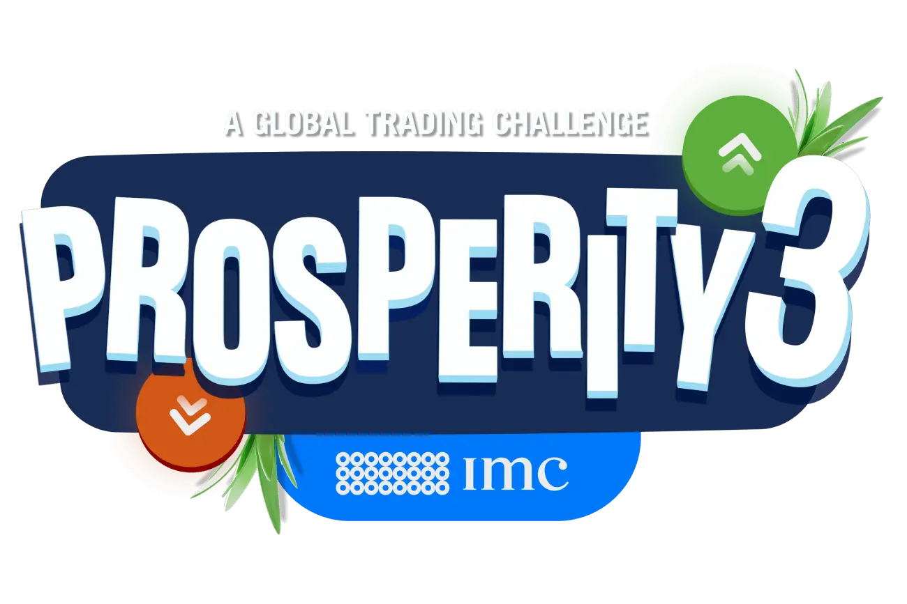

  

  
  
  

### 🏝️ Overview

This write-up contains team **Hustling Hokies'** strategy and implementation details for the [IMC Prosperity 3](https://prosperity.imc.com/) quantitative trading challenge. Our team placed **50th overall** and **15th in the United States** out of 13,559 registered teams.

| Round | Rank  |
|-------|-------|
| 1     | 724   |
| 2     | 63    |
| 3     | 6     |
| 4     | 68    |
| 5     | 50    |

---

### 🤗 Contributors

<table border="0" cellpadding="0" cellspacing="0">
  <tr>
    <!-- Jay Katyan -->
    <td align="center" valign="top" width="180">
       
      <b><a href="https://www.linkedin.com/in/jkatyan">Jay Katyan</a></b>
    </td>
    <!-- Rahul Ramakrishnan -->
    <td align="center" valign="top" width="180">
       
      <b><a href="https://www.linkedin.com/in/rahul-ramakrishnan10062003/">Rahul Ramakrishnan</a></b>
    </td>
    <!-- Andrew Zhang -->
    <td align="center" valign="top" width="180">
       
      <b><a href="https://www.linkedin.com/in/andrew-zhang-8985a2120/">Andrew Zhang</a></b>
    </td>
    <!-- Keyan Mikaili -->
    <td align="center" valign="top" width="180">
       
      <b><a href="https://www.linkedin.com/in/keyan-mikaili/">Keyan Mikaili</a></b>
    </td>
  </tr>
</table>

---

### 🐚 What is Prosperity?

Todo

---

### 🦑 Round 1

Todo

---

### 🥐 Round 2

Todo

---

### 🌋 Round 3

Todo

---

### 🏖️ Round 4

Todo

---

### 👀 Round 5

Todo

---

### 🔨 Tools

Todo

---

### 👥 References

Todo
